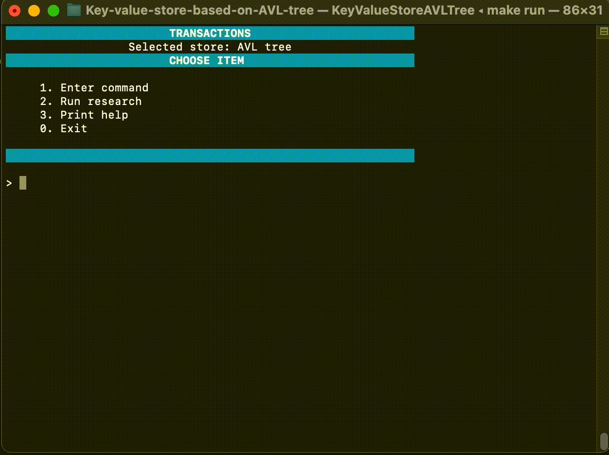

## Key-value-store-based-on-AVL-tree
Implementation in-memory key-value store based on self-balancing binary search tree (AVL tree). This console app is like a NoSQL redis database.

A key–value store is designed for storing, retrieving, and managing associative arrays. Such a store is implemented in
many programming languages as a container class dictionary.

 Dictionaries contain a collection of objects, or records,
which in turn have many different fields within them, each containing data. These records are stored and retrieved using
a key that uniquely identifies the record, and is used to quickly find the data within the database.

Many NoSQL databases such as Redis, Memcached, Tarantool and many, many others also implement the idea of such store due
to high read and write speeds. Key-value pairs databases support high separability and provide unprecedented horizontal
scaling unattainable with many other types of databases.

## Discription data structure

AVL treee is a binary search tree with logarithmic height. It is used when it is necessary to perform a quick search for items, alternating with the insertion of new items and the deletion of existing ones. In such
trees, the heights of the two subtrees differ by not more than 1.

## Data structure description
In the key-value store (AVL tree) the key will be strings and values (data) will be records of students in the following form:

- Last name
- First name
- Year of birth
- City
- Number of current

## Build
he project can be built using CMake version 3.15 or higher. To build app, follow these steps:

1. Clone this repository.
2. Navigate to the cloned directory.
3. For build: `make` or 
`cmake -S . -B ./build -D CMAKE_CXX_COMPILER=g++`, 
`cmake --build ./build`.
4. For run `make run`.
5. Launch tests `make tests`.

## Description of key-value store functions

This command is used to set the key and its value. In the example below, the key is the string foo, and the value is the structure described above. The values of the new record fields are entered in the order they are described in the structure. EX is used as an optional parameter to specify the lifetime of the record you are creating. If the optional field is not specified, the record lifetime is not limited by default.
```
SET foo Vasilev Ivan 2000 Moscow 55 
> OK
SET foo Vasilev 123 aaaaa Moscow 55 
> ERROR: unable to cast value "aaaa" to type int 
```
An example of using the SET command to create a record with a time limit. The record will exist for 10 seconds, and then it will be automatically deleted:
```
SET foo Vasilev Ivan 2000 Moscow 55 EX 10 
> OK
```

### GET

This command is used to get the value associated with the key. If there is no such record, (null) will be returned:
```
GET foo
> Vasilev Ivan 2000  Moscow   55 
GET unknownkey
> (null)
```

### EXISTS

This command checks if a record with the given key exists. It returns true if the object exists or false if it doesn't:
```
EXISTS foo
> true
```

### DEL

This command deletes the key and the corresponding value, then returns true if the record was successfully deleted, otherwise false:
```
DEL foo
> true
```

### UPDATE

This command updates the value by the corresponding key if such a key exists:
```
SET foo Vas I 20 Mos 5 
> OK
UPDATE foo Vasilev Ivan 2000 Moscow 55 
> OK
GET foo
> Vasilev Ivan 2000 Moscow 55
```
If there is a field that is not planned to change, it is replaced by a dash "-":
```
SET foo Vas I 20 Mos 5 
> OK
UPDATE foo Vasilev - - - 55
> OK
GET foo
> Vasilev I 20 Mos 55 
```

### KEYS

Returns all the keys that are in the store:
```
KEYS
1) boo
2) foo
3) bar
```

### RENAME

This command is used to rename keys:

```
RENAME foo foo2
> OK

GET foo
> (null)

GET foo2
> Vasilev I 20 Mos 55
```

### TTL

When the key is set with the time limit, this command can be used to view the remaining time. If there is no record with
the given key, `(null)` will be returned:

```
SET Vasilev Ivan 2000 Moscow 55 EX
10
> OK
TTL foo
> 6
TTL foo
> 5
TTL foo
> 4
TTL foo
> (null)
```

### FIND

This command is used to restore the key (or keys) according to a given value. Similarly to the `UPDATE` command, you
don’t have to specify all the values from the structure of the School 21 students. If any fields will not be searched,
it is replaced by a dash "-".

An example of using the `FIND` command to search through all fields of a student structure:

```
FIND Vasilev Ivan 2000 Moscow 55 
> 1) foo
FIND Vasilev Anton 1997 Tver 55
> 1) boo
```

An example of using the `FIND` command to search by last name and number of coins:

```
FIND Vasilev - - - 55
> 1) foo
> 2) boo
```

### SHOWALL

This command is used for getting all records that are in the key-value store at the moment:

```
SHOWALL
> № | Last name |   First name   | Year |  City   | Number of coins |
> 1   "Vasilev"       "Ivan"       2000  "Moscow"         55 
> 2   "Ivanov"       "Vasily"      2000  "Moscow"         55 
```

### UPLOAD

This command is used to upload data from a file. The file contains a list of uploaded data in the format:

```
key1 "Vasilev" "Ivan" 2001 " Rostov" 55
key2 "Ivanov" "Vasiliy" 2000 "Москва" 55 
...
key101 " Sidorov" "Sergei" 1847 "Suzdal" 12312313 
```

Command call:

```
UPLOAD ~/Desktop/TestData/file.dat
> OK 101
```

After the `OK` the number of strings uploaded from the file is displayed.

### EXPORT

This command is used to export the data that are currently in the key-value store to a file. The output of the file must
contain a list of data in the format:

```
key1 "Vasilev" "Ivan" 2001 " Rostov" 55
key2 "Ivanov" "Vasiliy" 2000 "Москва" 55 
...
key101 " Sidorov" "Sergei" 1847 "Suzdal" 12312313 
```

Command call:

```
EXPORT ~/Desktop/TestData/export.dat
> OK 101
```

After the `OK` the number of strings exported from the file is displayed.

## Demonstration of work



## License

This project is licensed under the [MIT License](LICENSE). See the LICENSE file for more details.